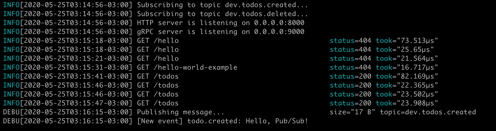

# zepto ⚡️

Zepto is a lightweight framework for the development of microservices & web services in golang.

As an opinionated framework, zepto proposes to have a quick setup and with the greatest needs for the development of modern microservices.

See below some of our features:

- gRPC & HTTP support
- Broker: Publish & Subscribe Events
    - Google Pub/Sub
    - Kafka (Comming soon...)
    - RabbitMQ (Comming soon)
- Healthcheck
- Gracefully Shutdown
- Pretty & Plugabble Logger


----

# Quick Start

```go
package main

import (
	"github.com/carlosstrand/zepto"
	"github.com/gorilla/mux"
	"net/http"
)

func main() {
	z := zepto.NewZepto(
		zepto.Name("ms.hello.world"),
		zepto.Version("latest"),
	)

	r := mux.NewRouter()

	r.HandleFunc("/hello", func(w http.ResponseWriter, r *http.Request) {
		_, _ = w.Write([]byte("Hello, World!"))
	})

	// Setup HTTP Server
	z.SetupHTTP("0.0.0.0:8000", r)

	z.Start()
}
```

---

# HTTP & gRPC 

With zepto, you can easily set up an HTTP and/or gRPC server. Both can work simultaneously.

```go
	// Setup gRPC Server
	z.SetupGRPC("0.0.0.0:9000", func(s *grpc.Server) {
		pb.RegisterTodosServer(s, handlers.NewGRPCHandler(svc))
	})

	// Setup HTTP Server
	z.SetupHTTP("0.0.0.0:8000", handlers.NewHTTPHandler(svc))
```


---- 

# Broker/PubSub

Publish and Receive messages in an easy way. Zepto abstracts all the encode/decode logic behind sending and receiving messages from your broker.It is also extensible, as it has an interface layer that facilitates the creation of new brokers.

## Broker Setup

```go
	// Setup Broker Provider (Google Pub/Sub)
	z.SetupBroker(gcp.NewBroker(
		gcp.ProjectID("my-project"),
		gcp.TopicPrefix("dev.accounts."),
	))
```

## Subscribe to Messages

```go
	z.Broker().Subscribe("created", func(ctx context.Context, user *pb.User) {
        fmt.Println("User created account: " + user.Name)
    })
```

## Publish Messages

```go
    z.Broker().Publish(ctx, "created", user)
```

# Logging

Zepto uses the [Logrus](https://github.com/sirupsen/logrus) library for Logging. It is extensible and customizable. You can define the log format you want, as well as which channel you want to log to. By default, our log looks like the one in the image below:



# What's next

The next steps will be to support other brokers like kafka and rabbitmq. It is also in my planning to create a zepto-cli to easily create projects using zepto.